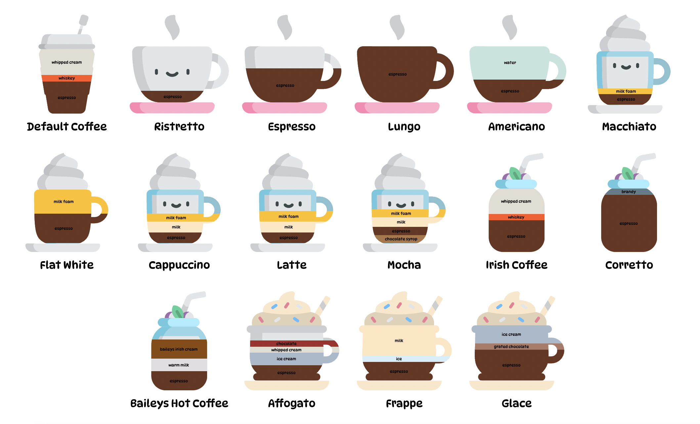

#### Завдання:
У вхідному об'єкті **COFFEE_TYPES** _(див. script.js)_ зробити кожну каву екземпляром відповідного класу (`Espresso, EspressoMilk, Alcoholic, Dessert`) та відрендерити в html у вигляді `div.cup` в `<section class="cups"></section>`.



#### ТЗ:

Створюємо `class Coffee`. Екземпляр даного класу містить лише свої початкові властивості. Методи класу:
1. `makeCoffee` – повертає верстку кожної кави у вигляді `div.cup` (на прикладі довільного об'єкту кави):
```JavaScript
let renderDefaultCoffee = new Coffee(
    {
        title: `Default Coffee`,
        ingredients: {
            espresso: 50,
            whiskey: 10,
            "whipped cream": 40
        }
    }
).makeCoffee();
```
```HTML
<div class="cup">
    <div class="coffee">
        <div class="coffee__ingredients">
            <p style="height: 50%" class="ingredient espresso">espresso</p>
            <p style="height: 10%" class="ingredient whiskey">whiskey</p>
            <p style="height: 40%" class="ingredient whipped__cream">whipped cream</p>
        </div>
    </div>
    <p class="coffee__title">Default Coffee</p>
</div>
```

, де:

1. `p.coffee__title` – назва кави з властивості title
2. `div.coffee__ingredients` – містить перелік всіх інгредієнтів кави з об'єкту `ingredients` у вигляді `p.ingredient`:
    * `style="height: 10%"` – процент вмісту інгредієнту (значення властивості)
    * `class="whiskey"` – назва інгредієнту (за назвою даного класу в `style.css` закріплено відповідного кольору `background`)

***

2. Якщо кава належить до масиву `Espresso`, наприклад Americano, то:
    * Робимо її екземпляром класу `Espresso`, який наслідує клас `Coffee`.
    * До `div.coffee` додаємо назву класу `coffee--espresso`. За назвою даного класу закріплено в стилях відповідну чашку:

```JavaScript
{
   title: `Americano`,
   ingredients: {
     espresso: 40,
     water: 60
   }
}
```

```HTML
<div class="cup">
    <div class="coffee coffee--espresso">
        <div class="coffee__ingredients">
            <p style="height: 40%" class="ingredient espresso">espresso</p>
            <p style="height: 60%" class="ingredient water">water</p></div>
    </div>
    <p class="coffee__title">Americano</p>
</div>
```

3. Якщо кава належить до масиву `EspressoMilk`, наприклад Mocha, то:
    * Робимо її екземпляром класу `EspressoMilk`, який наслідує клас `Coffee`.
    * До `div.coffee` додаємо назву класу `coffee--espressoMilk`.
4. Якщо кава належить до масиву `Alcoholic`, наприклад Irish Coffee, то:
    * Робимо її екземпляром класу `Alcoholic`, який наслідує клас `Coffee`.
    * До `div.coffee` додаємо назву класу `coffee--alcoholic`.
5. Якщо кава належить до масиву `Dessert`, наприклад Affogato, то:
    * Робимо її екземпляром класу `Dessert`, який наслідує клас `Coffee`.
    * До `div.coffee` додаємо назву класу `coffee--dessert`.

***

😌